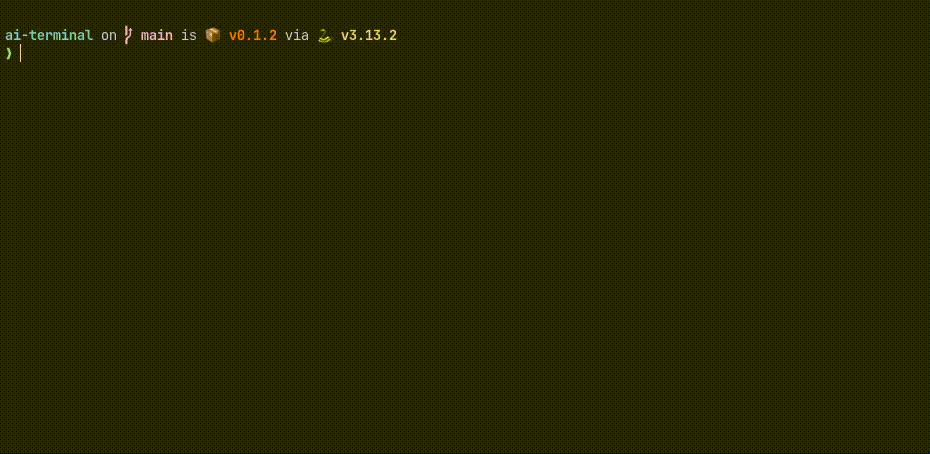

# ai-terminal

**Describe the task. Get the command. Hit Enter when you're ready.**

`ai` turns plain English into a Zsh command and places it at your prompt for
review. Ask a technical question and get a short answer instead. Routine command
requests come without an explanation.




One non-streaming request to OpenAI's GPT-5.4 mini per question. No agent loop,
tool access, or automatic command execution.

## Setup

Requires Python 3.12+, [uv](https://docs.astral.sh/uv/), and an OpenAI API key.
Autofill also requires Zsh and `python3` on your PATH.

From the cloned repository:

```sh
uv tool install .
```

Export your key in the shell where you use `ai`:

```sh
export OPENAI_API_KEY="your-api-key"
```

For persistence, set it in your private shell configuration or load it through
your secret manager. The installed CLI inherits this environment variable.

To enable prompt autofill:

```sh
ai init
```

Copy the printed function into `~/.zshrc`

```sh
ai show uncommitted git changes
ai ask what is the difference between TCP and UDP
```

`ask` is optional. Suggested commands are placed at your prompt; review them
before pressing Enter. Without the shell function, the CLI prints JSON with
`message` and `command` fields. Any answer text is also printed to stderr.

Requests use your OpenAI API account and incur API charges. Only your question
is sent as user input; the CLI does not read your project or shell history.


## Project Structure

```text
src/ai_terminal/
├── __init__.py
└── cli.py          # CLI, API request, response validation, and Zsh setup
docs/
└── demo.gif        # Terminal walkthrough (add your recording here)
pyproject.toml      # Package metadata and dependencies
uv.lock            # Locked dependency versions
```
